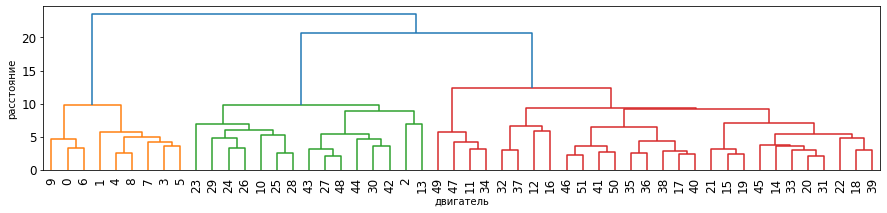
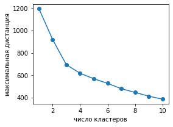
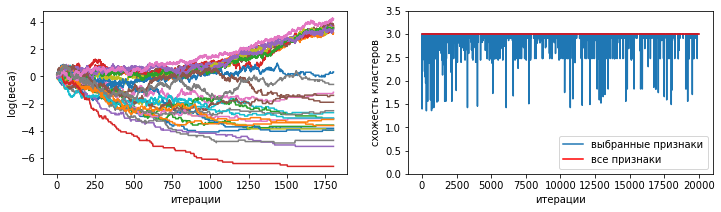
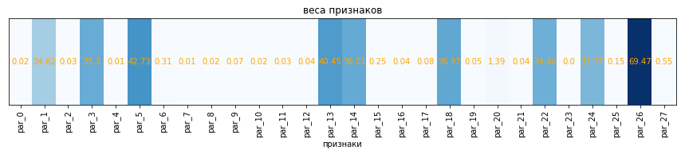

## Кластеризация ракетных двигателей по параметрам агрегатов. Определение значимых признаков.

Используя характеристики агрегатов ракетных двигателей определяем число кластеров двигателй методом KMeans и по дендрограмме.

Далее пытаемся определить по каким же признакам (характеристикам) происходит разделение двигателей на кластеры.

Данную задачу решаем применяя случайный поиск с адаптацией.

Грузим данные. Они уже отмасштабированы с применением StandardScaler.

Резцльтат агломеративной кластеризации.

Видим три кластера.

KMeans

По диаграмме локтя тоже три кластера. 

Какие же признаки сыграли наибольшую роль?

Ответ на это вопрос найдем применяя случайный поиск с адаптацией.

Алгоритм прост.

Случайно выбираем признаки. Делаем кластеризацию. Сравниваем распределения двигателей по кластерам с распределением, полученным на всех признаках. Вычисляем фитнес функцию (критерий качества) как: (число совпадений) / (число двигателей в кластере). См. функцию similarity в конце кода.

Если фитнес функция возросла, увеличиваем вероятноть выбора данным признакам. Если значение фитнес функции снизилось, то вероятность выбора уменьшаем. Делаем так заданное число раз.

Наиболее важные признаки будут иметь наибольшую вероятность выбора (вес), что мы и увидим на рисунке.

Веса признаков по итерациям. Те веса что идут вверх - относятся к наиболее важным признакам.

было признаков:   27

стало признаков:  9